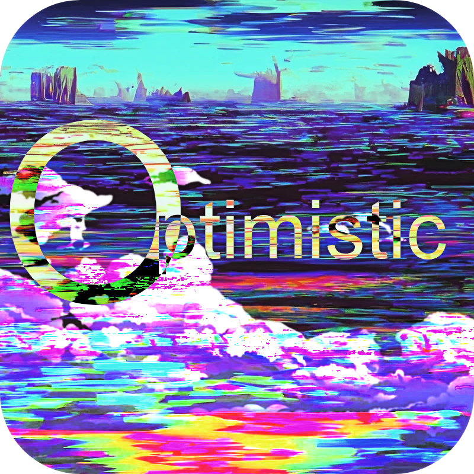

<h1 align="center">Optimistic</h1>

  

---

Optimistic is a webos (kinda) it runs with non-static files but its running html. 
It runs with many apps including 

## Apps

Scramjet has CAPTCHA support! Some of the popular websites that Scramjet supports include:

- [Scramjet](https://github.com/MercuryWorkshop/scramjet/blob/main/)
- Terminal (Real, running sudo etc)
- [games](https://optimistic.top/games/index.html)
& more
